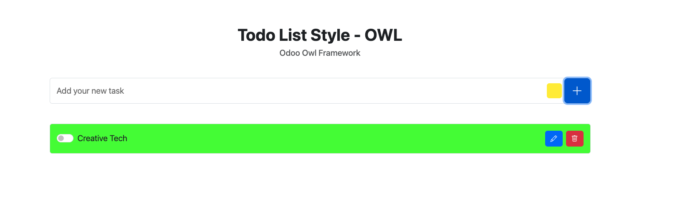

# 🎯 Todo List Style - OWL Framework

A modern, responsive Todo List application built with the Odoo Web Library (OWL) framework, featuring a clean UI and intuitive task management system.



## ✨ Features

- **Task Management**
  - ✅ Create, edit, and delete tasks
  - 🎨 Customize task colors
  - ✓ Mark tasks as complete/incomplete
  - 🔄 Real-time updates using OWL's reactive system

- **Modern UI**
  - 📱 Fully responsive design
  - 🎨 Bootstrap 5 styling
  - 🖌️ Custom color picker for tasks
  - 💫 Smooth transitions and animations

## 🚀 Quick Start

### Prerequisites

- Modern web browser
- Local development server (recommended)

### Installation

1. **Clone the repository**

```bash
git clone https://github.com/yourusername/todo-list-style.git
cd todo-list-style
```

1. **Set up local server**

    1. Using Python:

        ```bash
            python -m http.server 8000
        ```

    2. Using Node.js:

        ```bash
            npx serve
        ```

1. **Open in browser**

```plaintext
    http://localhost:8000
```

## 🏗️ Project Structure

```plaintext
todo-list-style/
├── static/
│   ├── components/
│   │   ├── root.js        # Main component
│   │   └── task.js        # Task component
│   ├── css/
│   │   └── styles.css     # Custom styles
│   └── libraries_js/
│       └── owl.iife.js    # OWL framework
├── app.js                 # Application entry point
├── index.html            # Main HTML file
└── README.md             # Documentation
```

## 🛠️ Technical Stack

- **Frontend Framework**: [OWL (Odoo Web Library)](https://github.com/odoo/owl)
- **CSS Framework**: [Bootstrap 5.3.3](https://getbootstrap.com/)
- **Icons**: [Bootstrap Icons 1.11.3](https://icons.getbootstrap.com/)
- **Architecture**: Component-based with reactive state management

## 💻 Development

### Component Architecture

#### Root Component (`root.js`)

- Manages the main application state
- Handles task list operations
- Renders the main UI structure

```javascript
// Example of task creation
addTask() {
    const newTask = {
        id: Date.now(),
        name: this.state.name,
        isCompleted: false,
        color: this.state.color,
    }
    this.tasks.push(newTask)
}
```

#### Task Component (`task.js`)

- Handles individual task operations
- Manages edit/view states
- Controls task completion status

```javascript
// Example of task toggling
toggleTask() {
    this.state.isCompleted = !this.state.isCompleted
}
```

## 🔧 Configuration

The application can be customized through the following files:

- `static/css/styles.css`: Custom styling
- `static/components/root.js`: Main component configuration
- `index.html`: Dependencies and mounting point

## 📱 Browser Support

- Chrome (latest)
- Firefox (latest)
- Safari (latest)
- Edge (latest)
- Mobile browsers (iOS/Android)

## 🤝 Contributing

1. Fork the repository
2. Create your feature branch (`git checkout -b feature/AmazingFeature`)
3. Commit your changes (`git commit -m 'Add some AmazingFeature'`)
4. Push to the branch (`git push origin feature/AmazingFeature`)
5. Open a Pull Request

## 📝 License

This project is licensed under the MIT License - see the [LICENSE](LICENSE) file for details.

## 👏 Acknowledgments

- [OWL Framework](https://github.com/odoo/owl) - For providing the reactive framework
- [Bootstrap](https://getbootstrap.com/) - For the responsive design system
- [Bootstrap Icons](https://icons.getbootstrap.com/) - For the beautiful icons

## 📞 Contact

Jorge Alberto Quiroz Sierra - [LinkedIn](https://www.linkedin.com/in/jorgealqs/) - [joralquisi@hotmail.com](mailto:joralquisi@hotmail.com) - [WhatsApp](https://wa.me/573193662738?text=Hola%20Jorge,%20me%20interesa%20hablar%20contigo)

---

Made with ❤️ using OWL Framework
