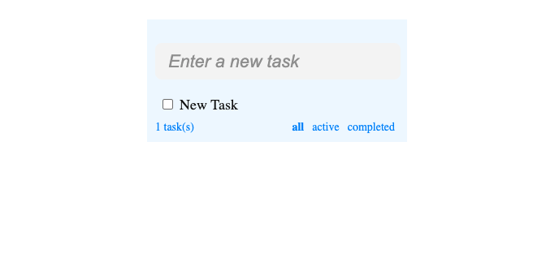

# 📌 To-Do List con OWL

Un **To-Do List** interactivo construido con [OWL (Odoo Web Library)](https://github.com/odoo/owl), utilizando una arquitectura basada en componentes y un almacenamiento de tareas en `localStorage`.

## 🚀 Características

✅ Agregar nuevas tareas
✅ Marcar tareas como completadas
✅ Eliminar tareas
✅ Persistencia en `localStorage`
✅ Interfaz minimalista y moderna

---

## 📂 Estructura del Proyecto

```
📦 todo-list
 ┣ 📂 static
 ┃ ┗ 📂 components
 ┃ ┃ ┣ 📜 root.js
 ┃ ┃ ┗ 📜 task.js
 ┃ ┃ 📂 ccs
 ┃ ┃ ┣ 📜 app.css
 ┃ ┃ 📂 libraries_js
 ┃ ┃ ┣ 📜 owl.js
 ┣ 📜 store.js
 ┣ 📜 app.js
 ┣ 📜 index.html
 ┗ 📜 README.md
```

### 📌 Archivos Principales

- **`index.html`** → Contenedor principal de la aplicación.
- **`app.js`** → Punto de entrada donde se monta el componente `Root`.
- **`store.js`** → Implementación del store reactivo para gestionar las tareas.
- **`root.js`** → Componente principal que gestiona la lista de tareas.
- **`task.js`** → Componente para representar una tarea individual.
- **`app.css`** → Estilos de la aplicación.

---

## 🛠 Instalación y Uso

1️⃣ **Clonar el repositorio:**
```sh
 git clone git@github.com:jorgealqs/owl-odoo.git
```

2️⃣ **Abrir el archivo `index.html` en un navegador**

---

## 🖼 Capturas de Pantalla

✨ *Aquí puedes agregar imágenes o GIFs del funcionamiento de la app.*

---

## 🏗 Tecnologías Usadas

🔹 **OWL (Odoo Web Library)** – Framework frontend reactivo
🔹 **JavaScript (ES6+)**
🔹 **HTML & CSS**

---

## 📌 Contribuciones

¡Las contribuciones son bienvenidas! Si encuentras un error o tienes una mejora, siéntete libre de abrir un _issue_ o enviar un _pull request_.

---

## 📜 Licencia

Este proyecto está bajo la licencia **MIT**. Puedes usarlo, modificarlo y distribuirlo libremente.

🚀 ¡Gracias por visitar este proyecto! 😊